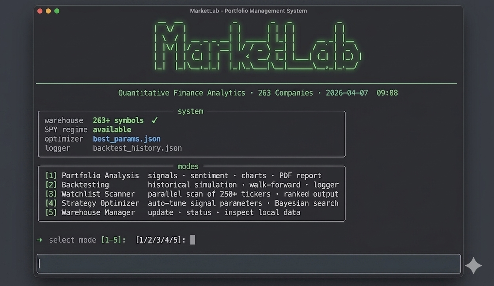

<div align="center">


<br/>

<p>
  <a href="https://github.com/youcefbt-dz/MarketLab"></a>
  <a href="https://python.org"></a>
  <a href="LICENSE"></a>
  <a href="https://github.com/youcefbt-dz/MarketLab/stargazers"></a>
</p>

**Open-source quantitative research framework — signals, backtesting, sentiment, and Bayesian strategy optimization.**

[🌐 Website](https://youcefbt-dz.github.io/MarketLab/) · [Quick Start](#quick-start) · [Architecture](#architecture) · [Features](#features) · [Backtesting](#backtesting-engine) · [Optimizer](#strategy-optimizer) · [Contributing](CONTRIBUTING.md)

</div>

---

## What is MarketLab?

MarketLab is a modular quantitative finance framework built for finance students, researchers, and aspiring quants. It transforms raw market data into structured trading intelligence through a full research pipeline:

```
Market Data  →  Indicators  →  Signals  →  Backtest  →  Optimize  →  Report
```

The project is designed to be readable, extensible, and portfolio-ready — with zero dependency on paid APIs or proprietary data.

> **Disclaimer:** MarketLab is built for educational and research purposes only. It does not constitute financial advice.

---
---

## The Command Center

The system features a streamlined, interactive CLI designed for high-efficiency quantitative research.

<div align="center">
  
</div>

---

## Strategic Intelligence Report

<div align="center">
  <table style="border-collapse: collapse; border: none; width: 100%;">
    <tr style="border: none;">
      <td align="center" style="border: none; width: 33.33%; padding: 10px; vertical-align: top;">
        <p><strong>Strategic Intelligence</strong></p>
        
      </td>
      <td align="center" style="border: none; width: 33.33%; padding: 10px; vertical-align: top;">
        <p><strong>Sentiment Analysis</strong></p>
        
      </td>
      <td align="center" style="border: none; width: 33.33%; padding: 10px; vertical-align: top;">
        <p><strong>Technical Charts</strong></p>
        
      </td>
    </tr>
  </table>
  <p>
    <sub><i>Visual outputs from MarketLab v3.1.0 — Processing localized market intelligence.</i></sub>
  </p>
</div>

---

## Architecture

```
┌──────────────────────────────────────────────────────────────┐
│  main.py — Entry Point                                       │
│                                                              │
│  Mode 1 · Portfolio Analysis    signals + sentiment + PDF    │
│  Mode 2 · Backtesting           walk-forward simulation      │
│  Mode 3 · Watchlist Scanner     250+ tickers in parallel     │
│  Mode 4 · Strategy Optimizer    Bayesian parameter search    │
│  Mode 5 · Warehouse Manager     local data management        │
└──────────────────────────────────────────────────────────────┘
         │                    │                    │
         ▼                    ▼                    ▼
   signals.py           backtest.py        strategy_optimizer.py
   13-rule scoring      walk-forward       Optuna · 26 params
   ATR exits            gap-aware exits    100 Bayesian trials
   ADX/regime filter    dynamic sizing     auto-apply to signals
         │                    │
         ▼                    ▼
   sentiment.py        backtest_logger.py
   VADER + booster      JSON history
   tail risk detect     reliability score
         │
         ▼
   report_generator.py
   PDF · ReportLab
   Goldman Sachs palette
```

**Data layer:**

```
stock_warehouse.py  →  data/AAPL.csv, MSFT.csv, ... (250+ symbols, ~1.8M rows)
                        load_local(ticker, start, end)  — no internet per run
```

---

## Features

### Signals Engine

A 13-rule scoring system that produces `BUY` / `HOLD` / `SELL` signals with dynamic exit levels.

| Rule | Points |
|------|--------|
| Price vs MA200 (trend direction) | ±2 |
| Golden / Death Cross (MA50 vs MA200) | ±1 |
| ADX Trend Strength | −3 / +1 |
| RSI/Price Divergence | ±3 |
| Double Oversold / Overbought | ±4 |
| MA200 Support Test | +1 |
| Bear Market Deep Penalty | −2 |
| Stochastic Crossover | ±1 |
| MACD Crossover | ±2 |
| Bollinger Band Touch | ±2 |
| Volume Confirmation | ±2 |
| Volatility Filter (ATR%) | ±1 to ±3 |
| Market Regime (S&P 500 MA200) | 0 / −3 |
| Relative Strength vs S&P 500 | ±1 to ±2 |

**Signal thresholds:**

```
Score ≥  6  →  BUY         (≥ 8 + bullish trend → STRONG BUY)
Score ≤ −6  →  SELL        (≤ −10 + bearish trend → STRONG SELL)
Otherwise   →  HOLD
```

**Filters (v3.1):**
- `MIN_ADX_ENTRY = 18` — blocks entry in choppy, trendless markets (−3 penalty)
- Bear market penalty — −2 when price is 15%+ below MA200
- ATR × 2.5 stop loss — adapts to each stock's actual volatility

### Exit Strategy

| Condition | Risk / Reward |
|-----------|--------------|
| Bullish trend + score ≥ 8 | 1 : 3.0 |
| Bullish trend + score ≥ 6 | 1 : 2.5 |
| Default | 1 : 2.3 |
| Bearish score ≤ −8 | 1 : 3.0 |

Stop Loss = `price ± (2.5 × ATR14)` — dynamically sized to each stock's volatility.

---

### Backtesting Engine

Walk-forward simulation with zero look-ahead bias across any date range and ticker.

- **Gap-aware exits** — if Open gaps below SL, exits at Open (not SL price)
- **Dynamic position sizing** — 35% for STRONG BUY, 22% for BUY, 15% fallback
- **Portfolio cap** — maximum 70% deployed, 40% per single position
- **Cooldown logic** — 8 bars idle after a loss (configurable)
- **Rolling metrics** — Sharpe, Beta, and annualized return pre-computed in O(N)
- **Full trade log** — entry/exit dates, prices, PnL, R-Multiple, exit reason

**Output per run:**

| Metric | Description |
|--------|-------------|
| Total Return | Strategy vs Buy & Hold |
| Win Rate | % of profitable trades |
| Profit Factor | Gross profit / gross loss |
| Sharpe Ratio | Annualized risk-adjusted return |
| Max Drawdown | Peak-to-trough equity decline |
| Avg R-Multiple | Realized vs expected risk/reward |
| Exit Reason Breakdown | TP hits / SL hits / Gap exits |

---

### Strategy Optimizer

Bayesian optimization using **Optuna** to automatically tune signal parameters across 26 dimensions.

```bash
python strategy_optimizer.py          # run 100 Bayesian trials
python strategy_optimizer.py --apply  # apply best_params.json to signals.py
```

**How it works:**

```
Trial N
  └─ Suggest 26 params (BUY_THRESHOLD, ATR_mult, RSI levels, ADX, weights...)
       └─ Run backtest on 7-stock basket (local data, no internet)
            └─ Score = Sharpe × WinRate / |MaxDD|
                 └─ Optuna learns → next trial smarter
                      └─ After 100 trials → save best_params.json
```

- First 20 trials: random exploration
- Trials 21–100: TPE Bayesian search (learns from prior results)
- Results auto-applied to `signals.py` with a timestamped backup
- Basket: AAPL, MSFT, NVDA, TSLA, JPM, XOM, AMZN

---

### Watchlist Scanner

Scans 250+ tickers in parallel and ranks by signal strength.

```bash
python watchlist_scanner.py                      # top 20, min score 4
python watchlist_scanner.py --top 10 --min-score 6
python watchlist_scanner.py --export results.csv
```

Output per ticker: signal, score, price, RSI, ADX, ATR%, RS%, stop loss, take profit.

---

### Sentiment Analysis

- **VADER NLP** with custom financial keyword boosting (`beats`, `misses`, `downgrade`, `rally`, etc.)
- **Time-weighted scoring** — recent news carries more weight (72h decay)
- **Tail risk detection** — single strong negative headline triggers score adjustment
- **Confidence scoring** with positive/negative ratio breakdown

---

### Local Data Warehouse

```bash
python stock_warehouse.py   # download / update all 250+ symbols
```

- Stores full OHLCV history for 250+ symbols as local CSV files
- ~1.8 million rows total — no repeated API calls
- Smart incremental updates — only fetches new rows since last run
- 7-day update interval with automatic staleness detection
- All analysis and backtesting reads from disk — fast and offline-capable

---

### Black Box Logger

Every backtest run is automatically persisted to `backtest_history.json`.

**Reliability Score (0–100):**

```
Score = Pass Rate × 40%
      + Avg Win Rate × 25%     (target: 65%)
      + Avg Profit Factor × 20% (target: 2.5)
      + Beat Benchmark Rate × 15%
```

Breakdown per ticker and per market regime (Bull / Sideways / Bear).

---

### PDF Report

Professional executive summary generated with ReportLab:

- Signal badge, score, confidence level
- Market data and indicator table
- Algorithm trigger breakdown
- News sentiment badge + headline list
- 5 technical charts (Price/MA, BB, RSI, MACD, Stochastic)
- Qualitative financial interpretation

---

## Quick Start

**1. Clone**

```bash
git clone https://github.com/youcefbt-dz/MarketLab.git
cd MarketLab
```

**2. Install dependencies**

```bash
pip install -r requirements.txt
```

**3. Build the local data warehouse** *(recommended first step)*

```bash
python stock_warehouse.py
```

Downloads 250+ symbols as local CSV files. All subsequent runs read from disk.

**4. Run MarketLab**

```bash
python main.py
```

**5. Optimize signal parameters** *(optional)*

```bash
python strategy_optimizer.py
python strategy_optimizer.py --apply
```

---

## Project Structure

```
MarketLab/
│
├── main.py                  # Entry point — 5 modes
├── signals.py               # Signal engine (13 rules, ATR exits)
├── backtest.py              # Walk-forward backtesting engine
├── backtest_logger.py       # Black Box Logger + reliability score
├── strategy_optimizer.py    # Bayesian parameter optimizer (Optuna)
├── watchlist_scanner.py     # Parallel 250+ ticker scanner
├── sentiment.py             # NLP sentiment (VADER + boosters)
├── report_generator.py      # PDF report builder (ReportLab)
├── stock_warehouse.py       # Local data warehouse (250+ symbols)
│
├── companies.json           # 240+ name → ticker mappings
├── requirements.txt
├── logo.svg
│
├── data/                    # Local CSV warehouse (gitignored)
│   ├── AAPL.csv
│   ├── MSFT.csv
│   └── _metadata.json
│
├── backtest_results/        # Trade logs, equity curves, reports
├── backtest_history.json    # Accumulated backtest runs
├── best_params.json         # Latest optimizer output
│
└── docs/
    ├── index.html           # Landing page
    └── screenshots/
```

---

## Dependencies

```
pandas>=2.0.0          numpy>=1.26.0         pandas-ta>=0.3.14b
yfinance>=0.2.40       scipy>=1.11.0         matplotlib>=3.8.0
reportlab>=4.0.0       vaderSentiment>=3.3.2  thefuzz>=0.22.0
flask>=3.0.0           flask-cors>=4.0.0      optuna>=3.0.0
```

---

## Supported Symbols

240+ pre-mapped companies across sectors via `companies.json`:

| Sector | Examples |
|--------|---------|
| Technology | AAPL, MSFT, NVDA, AMD, GOOGL, META |
| Finance | JPM, GS, V, MA, BLK, BAC |
| Healthcare | LLY, ABBV, JNJ, PFE, MRNA |
| Consumer | AMZN, TSLA, NKE, DIS, WMT |
| Energy | XOM, CVX, SHEL, BP, TTE |
| ETFs | SPY, QQQ, GLD, IBIT, ETHA |

---

## Roadmap

- [x] ATR-based dynamic stop loss
- [x] Bayesian strategy optimizer (Optuna)
- [x] Local data warehouse (250+ symbols)
- [x] Parallel watchlist scanner
- [x] Black Box reliability logger
- [x] Landing page + GitHub Pages
- [ ] Trailing stop + partial exit
- [ ] Swing trading module (shorter timeframes)
- [ ] Crypto module (CCXT integration)
- [ ] React dashboard for live signal monitoring

---

## Changelog

See [SYSTEM_RELEASE_HISTORY.md](./SYSTEM_RELEASE_HISTORY.md) for full version history.

**v3.1.0** — Signal Filters + CLI Refactor
- Refactored `main.py` into 5-mode interactive CLI
- Added `MIN_ADX_ENTRY = 18` filter — blocks entry in choppy markets
- Added bear market deep penalty (−2 when price 15%+ below MA200)
- ATR stop loss multiplier: 1.5 → 2.5 for more realistic exits
- Parallel watchlist scanner improvements
- Launched [project landing page](https://youcefbt-dz.github.io/MarketLab/)

**v3.0.0** — Strategy Optimizer
- Added `strategy_optimizer.py` — 100-trial Bayesian optimization via Optuna
- Upgraded `main.py` Mode 4: ML Predictor → Strategy Optimizer

**v2.8.0** — Watchlist Scanner + Warehouse  
**v2.5.0** — ML Predictor (SMOTE + 3 models)  
**v2.4.0** — Black Box Logger + Reliability Score  

---

## Contributing

Contributions are welcome. Please read [CONTRIBUTING.md](CONTRIBUTING.md) before submitting a pull request.

```bash
git checkout -b feature/your-feature-name
```

---

## License

Licensed under the **Apache License 2.0** — see [LICENSE](LICENSE) for details.

---

<div align="center">
<sub>Built for the quant community</sub>
</div>
