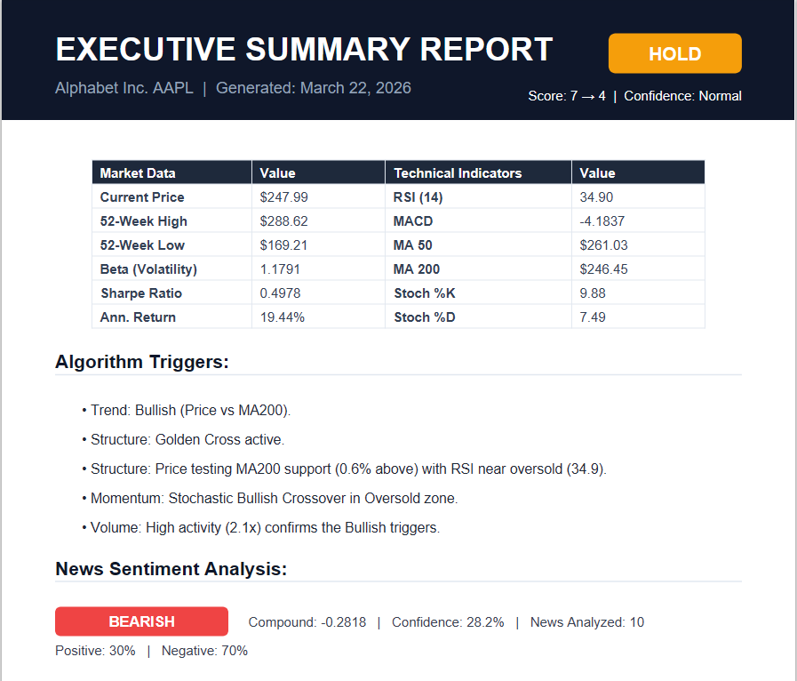
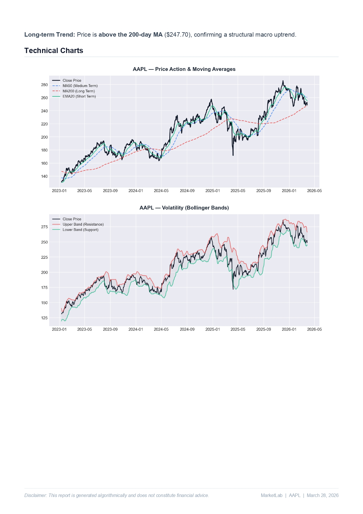
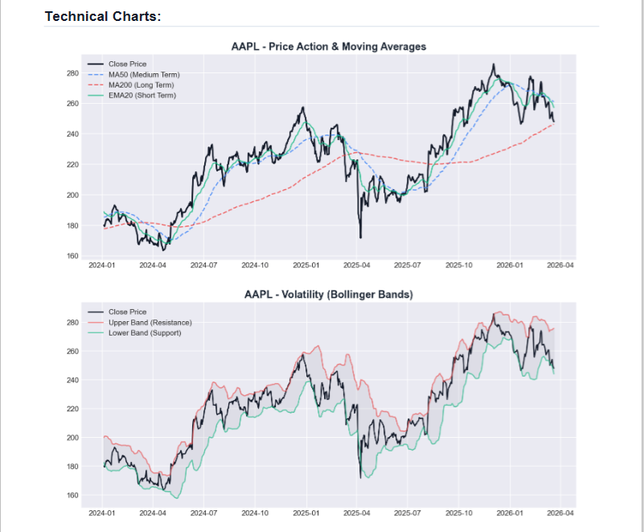

<div align="center">
  
  <br/><br/>

[](https://github.com/youcefbt-dz/python-finance-analyst)
[](https://python.org)
[](LICENSE)
[](https://github.com/youcefbt-dz)
[](https://github.com/youcefbt-dz/python-finance-analyst/stargazers)

**An open-source quantitative research and trading framework for stock analysis, strategy validation, and financial decision-making.**

[Quick Start](#quick-start) · [Features](#features) · [Backtesting](#backtesting-engine) · [Black Box Logger](#black-box-logger) · [Screenshots](#screenshots) · [Contributing](CONTRIBUTING.md)

</div>

---

## Overview

**MarketLab** is a quantitative research and trading framework built for finance students, researchers, and aspiring quants.

It integrates technical analysis, risk modeling, NLP-driven sentiment analysis, a rule-based signals engine, a full backtesting system, and a **self-improving reliability tracker** into a single modular pipeline — transforming raw market data into actionable intelligence.

```
Raw Market Data  →  Technical Indicators  →  Trading Signals  →  Backtesting  →  Black Box Logger  →  Reliability Score
```

> ⚠️ **Disclaimer:** MarketLab is for educational and research purposes only. It does not constitute financial advice.

---

## Screenshots

<div align="center">

### 📄 Executive Summary Report


### 🧠 News Sentiment Analysis


### 📈 Technical Charts


### 📊 Seasonality Analysis


</div>

---

## Features

### 📐 Technical Analysis
| Indicator | Description |
|-----------|-------------|
| Moving Averages | MA50, MA200, EMA20, EMA50 |
| Momentum | RSI (14), MACD, Stochastic %K/%D |
| Volatility | Bollinger Bands (20, ±2σ) |
| Divergence | RSI/Price Bullish & Bearish Divergence |

### 📡 Signals Engine
- **10-indicator scoring system** producing BUY / HOLD / SELL signals
- **Market Regime Filter** — S&P 500 MA200 used to switch between Risk-On / Risk-Off
- **Relative Strength Filter** — only enter stocks outperforming the S&P 500
- **Sentiment Integration** — news score adjusts the final signal
- **Dynamic Exit Strategy** — auto-calculated Stop Loss & Take Profit (default Risk/Reward 1:2.3)
- **Divergence Detection** — RSI/Price swing high-low comparison over configurable lookback

### 📰 Sentiment Analysis
- **VADER NLP** with custom financial keyword boosting (`beats`, `misses`, `downgrade`, etc.)
- **Time-weighted scoring** — recent news carries more weight (decay over 72h)
- **Tail Risk detection** — single strong negative news triggers a score adjustment
- **Confidence scoring** with positive/negative ratio breakdown

### 📊 Risk & Performance Metrics
- Beta, R², Sharpe Ratio (annualized), Annualized Return
- Configurable risk-free rate (default: 4%)
- Cross-asset correlation matrix

### 📅 Seasonality Analysis
- Best and worst month detection per ticker
- Monthly average return bar chart exported as PNG

### 🔁 Backtesting Engine
- Walk-forward simulation with zero look-ahead bias
- Gap-down / gap-up realistic exit pricing
- Dynamic position sizing (35% for STRONG BUY, 22% for BUY)
- Trailing Stop Loss, Partial Exit, and Time Exit support
- Full metrics: Win Rate, Profit Factor, Sharpe, Max Drawdown, R-Multiple

### 📦 Black Box Logger *(v2.4.0)*
- Persistent JSON history of every backtest run
- **Reliability Score (0–100)** computed from accumulated results
- Per-ticker and per-market-regime breakdown
- Trend detection: Improving / Stable / Declining
- ML-ready dataset export for future model training

### 📄 PDF Report Generation
- Professional executive summary with all indicators, signals, sentiment, and charts
- Goldman Sachs-inspired color palette with embedded sparklines

---

## Real-World Results

After **42 backtests** across 20 tickers (2017–2026):

| Metric | Value |
|--------|-------|
| Overall Reliability Score | **62.3 / 100** |
| System Pass Rate | 55.6% |
| Bear Market Pass Rate | **83.3%** |
| Trend | 📈 Improving |

**Per-ticker reliability (top performers):**

| Ticker | Score | Runs |
|--------|-------|------|
| AAPL | 🟢 92.8 / 100 | 12 |
| ADBE | 🟢 85.0 / 100 | 1 |
| GOOGL | 🟢 85.0 / 100 | 2 |
| NVDA | 🟢 82.1 / 100 | 2 |
| JPM | 🟢 84.7 / 100 | 1 |

> Results accumulate automatically — each new backtest run refines the reliability model.

---

## Quick Start

### 1. Clone the repository

```bash
git clone https://github.com/youcefbt-dz/python-finance-analyst.git
cd python-finance-analyst
```

### 2. Install dependencies

```bash
pip install -r requirements.txt
```

### 3. Run the analyzer

```bash
python main.py
```

You will be prompted to:
- Choose a mode: **Live Analysis** or **Backtesting**
- Enter the number of stocks and years of historical data
- Input company names (e.g. `Apple`, `TSLA`, `NVIDIA`) or ticker symbols

> The fuzzy search engine will resolve names automatically using `companies.json` (240+ companies supported).

### 4. Run the backtesting engine

```bash
python backtest.py
```

Results are saved to `backtest_results/` and logged automatically to `backtest_history.json`.

### 5. View the reliability report

```bash
python backtest_logger.py
```

---

## How It Works

```
┌─────────────────────────────────────────────────────────────┐
│                         main.py                             │
│                                                             │
│  1. Fetch data           yfinance / local warehouse         │
│  2. Compute indicators   pandas-ta, scipy, numpy            │
│  3. Analyze sentiment    VADER + financial booster          │
│  4. Generate signal      signals.py (10 rules)              │
│  5. Export charts        matplotlib                         │
│  6. Generate PDF         reportlab                          │
└─────────────────────────────────────────────────────────────┘

┌─────────────────────────────────────────────────────────────┐
│                       backtest.py                           │
│                                                             │
│  1. Walk-forward simulation    no look-ahead bias           │
│  2. Dynamic position sizing    35% / 22% per signal         │
│  3. Exit management            SL / TP / Time Exit          │
│  4. Auto-log results     →     backtest_logger.py           │
└─────────────────────────────────────────────────────────────┘

┌─────────────────────────────────────────────────────────────┐
│                   backtest_logger.py                        │
│                                                             │
│  1. Persist run to JSON        backtest_history.json        │
│  2. Compute Reliability Score  weighted 4-factor model      │
│  3. Per-ticker breakdown       score + pass rate + regime   │
│  4. Export ML dataset          ready for training           │
└─────────────────────────────────────────────────────────────┘
```

### Signal Scoring Logic

```
Score  ≥  5  →  BUY        (≥ 7 + bullish trend → STRONG BUY)
Score  ≤ -5  →  SELL       (≤ -10 + bearish trend → STRONG SELL)
Otherwise    →  HOLD
```

| Rule | Weight |
|------|--------|
| Price vs MA200 (trend) | ±2 |
| Golden / Death Cross | ±1 |
| RSI/Price Divergence | ±3 |
| Double Oversold / Overbought | ±4 |
| Stochastic Crossover | ±1 |
| MACD Crossover | ±2 |
| Bollinger Band Touch | ±2 |
| Volume Confirmation | ±2 |
| Sharpe Quality Filter | ±2 |
| Market Regime (S&P 500 MA200) | ±3 |
| Relative Strength vs S&P 500 | ±2 |
| News Sentiment | ±1 to ±3 |

### Reliability Score Formula

```
Reliability Score = Σ (component × weight) × 100

  Pass Rate           × 40%
  Avg Win Rate        × 25%   (normalized to 65% target)
  Avg Profit Factor   × 20%   (normalized to 2.5 target)
  Beat Benchmark Rate × 15%
```

---

## Project Structure

```
python-finance-analyst/
│
├── main.py               # Entry point — Live Analysis mode
├── backtest.py           # Backtesting engine (walk-forward)
├── backtest_logger.py    # Black Box Logger + Reliability Engine
├── signals.py            # Signal generation (10-rule scoring)
├── sentiment.py          # NLP sentiment (VADER + boosters)
├── report_generator.py   # PDF report builder (ReportLab)
├── stock_warehouse.py    # Local data warehouse (250+ symbols)
├── companies.json        # 240+ company name → ticker mappings
├── requirements.txt      # Python dependencies
├── logo.svg              # Project logo
│
└── docs/
    └── screenshots/      # Screenshots for README
```

---

## Dependencies

```
yfinance>=0.2.40        # Market data
pandas>=2.0.0           # Data manipulation
pandas-ta>=0.3.14b      # Technical indicators
scipy>=1.11.0           # Linear regression (Beta, R²)
numpy>=1.26.0           # Numerical operations
matplotlib>=3.8.0       # Chart generation
reportlab>=4.0.0        # PDF report generation
vaderSentiment>=3.3.2   # NLP sentiment analysis
thefuzz>=0.22.0         # Fuzzy company name matching
flask>=3.0.0            # Optional web interface
flask-cors>=4.0.0       # CORS for Flask API
```

---

## Supported Companies

MarketLab ships with `companies.json` containing **240+ pre-mapped companies** across sectors:

| Sector | Examples |
|--------|----------|
| Tech | Apple, Microsoft, NVIDIA, AMD, Google |
| Finance | JPMorgan, Goldman Sachs, Visa, Mastercard |
| Healthcare | Pfizer, Moderna, Eli Lilly, J&J |
| Consumer | Tesla, Amazon, Nike, Disney, McDonald's |
| Energy | ExxonMobil, Chevron, Shell, BP |
| ETFs | SPY, QQQ, GLD, IBIT (Bitcoin ETF) |

---

## Roadmap

- [ ] Trailing Stop + Partial Exit implementation
- [ ] ML model trained on accumulated backtest history
- [ ] Streamlit dashboard for reliability visualization
- [ ] Parameter auto-adjustment via feedback loop

---

## Changelog

**v2.4.0** — Latest
- Added Black Box Logger (`backtest_logger.py`) with persistent JSON history
- Added Reliability Score engine (0–100) with per-ticker and per-regime breakdown
- Added Relative Strength Filter vs S&P 500
- Added Time Exit rule (exit if < 2% gain in 3 days)
- Widened Stop Loss margin (BB lower × 0.95) to reduce Gap Down exits
- Lowered STRONG BUY threshold from score ≥ 10 to score ≥ 7

**v2.3.0**
- Added RSI/Price divergence detection
- Added Market Regime Filter (S&P 500 MA200)
- Added dynamic exit strategy (Stop Loss / Take Profit)
- Improved sentiment with Tail Risk detection & time-weighting

---

## Contributing

Contributions are welcome! Please read [CONTRIBUTING.md](CONTRIBUTING.md) before submitting a pull request.

```bash
git checkout -b feature/your-feature-name
```

---

## License

Licensed under the **Apache License 2.0** — see [LICENSE](LICENSE) for details.

---

<div align="center">

Made with ❤️ by <a href="https://github.com/youcefbt-dz">youcefbt-dz</a>

⭐ Star the repo if you find it useful!

</div>
